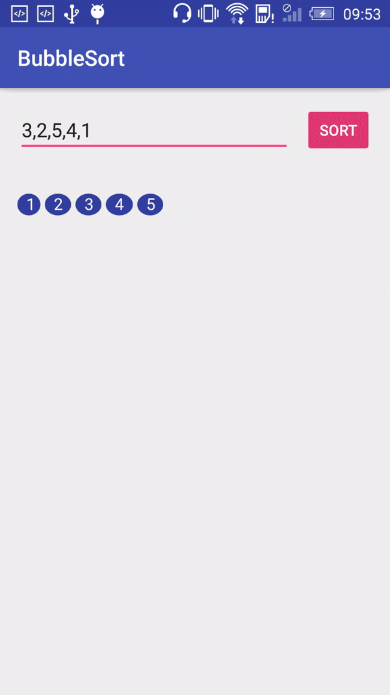
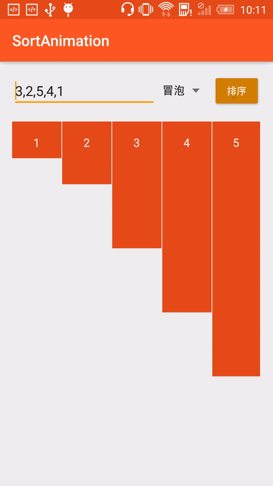
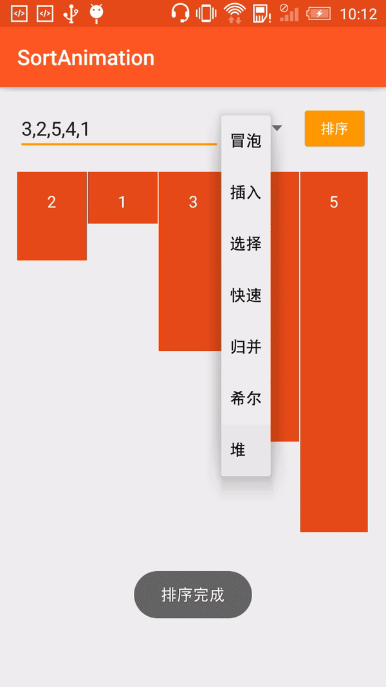
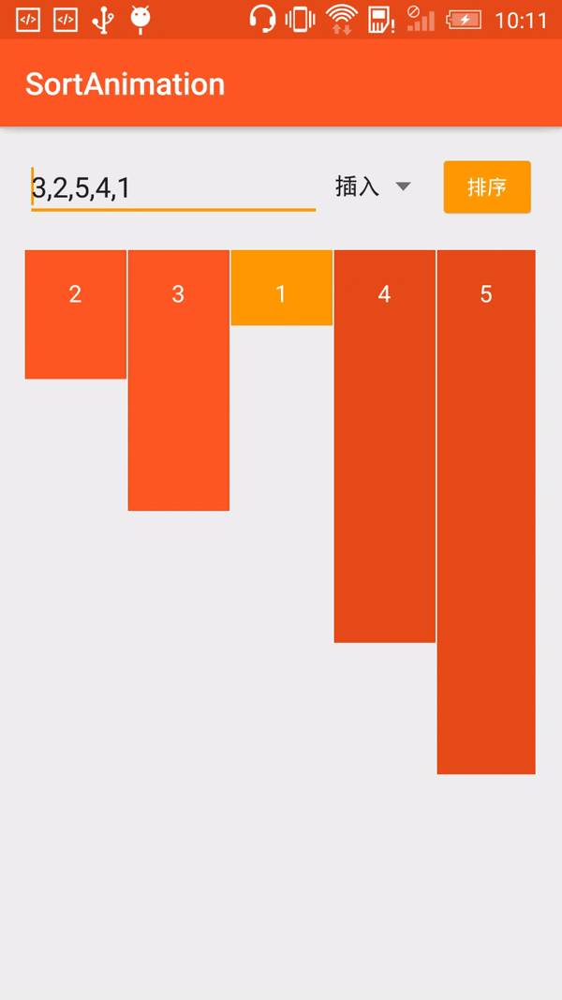
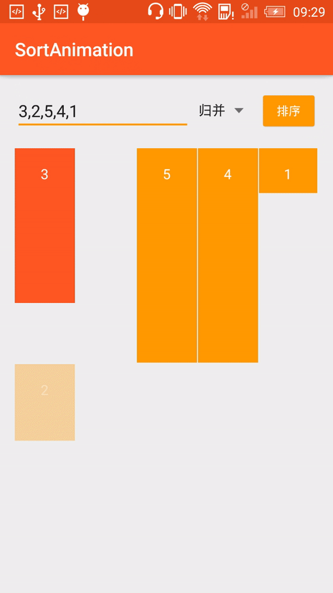
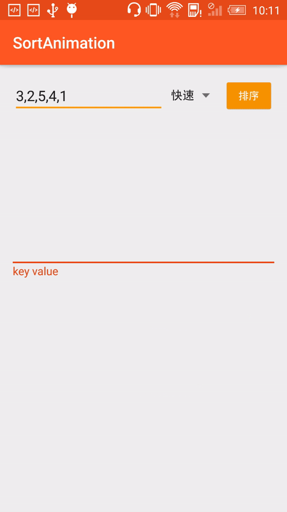
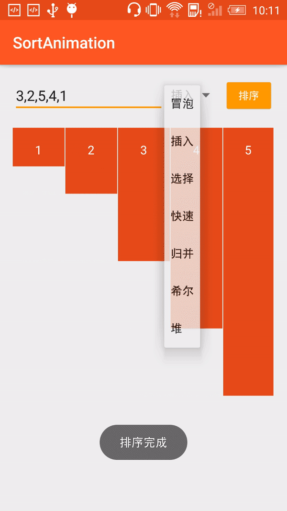

## 前言
最近在学习基础的排序算法，发现仅凭算法的定义公式，即使结合代码在IDE下debug查看数组变化，也依然不是很好的理解，于是就在网上搜索排序算法动画，果然已经有人实现了排序演示，有java实现的，有JS实现，但很想在android手机上看简单演示，最终找到了，[ukhanoff/AndroidSortAnimation](https://github.com/ukhanoff/AndroidSortAnimation)，一个国际友人，用android实现了基础的冒泡排序法。（左边为他的实现效果，右侧为我的实现效果）

 

在这之前，我也尝试过使用RecycleView或者自定义View实现类似效果，但依然还是败下阵来，在参考[ukhanoff/AndroidSortAnimation](https://github.com/ukhanoff/AndroidSortAnimation)后，我增加了其他几种排序算法动画，同时将上边的自定义图形，从球形设置成了长方体，动画效果将和[liusaint/sortAnimation](https://github.com/liusaint/sortAnimation)
以及[在线动画演示各种排序算法过程 - aTool在线工具](http://www.atool.org/sort.php)两种JS实现效果相一致，达到了相对预期的效果，排序算法分别包括包含冒泡、插入、选择、快速、归并、希尔、堆排序。

  
  
接下来，我将分享下android平台下，如何实现排序动画。
##### 备注：文章中仅展示关键代码用来说明思路，全部代码请移步：[54wall/SortAnimation](https://github.com/54wall/SortAnimation)

首先大概讲解下大神[ukhanoff](https://github.com/ukhanoff/AndroidSortAnimation)
，参考将大象被装到冰箱，他是如何实现的冒泡排序法。
他主要用到了三个基础知识：
#### 自定义View 
#### Android属性动画之ValueAnimator 
#### ViewGroup中addView与removeView
接下来分步骤展开说明下
### 借助自定义View实现可以变色的小球
自定义BubbleView继承AppCompatImageView，新增设置小球处于选中状态，复写onDraw()等方法代码如下：
```java
/**
 * This is custom ImageView which could draw a "Bubble with a number inside".
 */

public class BubbleView extends AppCompatImageView {
    public static final int START_X_POS
 = 25;
    public static final int TEXT_BASELINE_Y = 105;
    public static final int BOTTOM_POS = 120;
    public static final int TOP_POS = 60;
    public static final float TEXT_SIZE = 45f;
    //方法2 直接new 避免avoid object allocation during draw/layout operations (prelocate and reuse instead)
//    Paint paint = new Paint(Paint.LINEAR_TEXT_FLAG);
//    Rect bounds = new Rect();
    Paint paint;
    Rect bounds;
    private String TAG = BubbleView.class.getSimpleName();
    private Integer valueToDraw;
    private boolean isSelected;
    private boolean isOnFinalPlace;

    public BubbleView(Context context) {
        this(context, null);
        init();
    }

    public BubbleView(Context context, AttributeSet attrs) {
        this(context, attrs, 0);
        init();
    }

    public BubbleView(Context context, AttributeSet attrs, int defStyleAttr) {
        super(context, attrs, defStyleAttr);
        init();
    }

    private void init() {
        paint = new Paint(Paint.LINEAR_TEXT_FLAG);
        paint.setAntiAlias(true);
        paint.setTextSize(TEXT_SIZE);
        bounds = new Rect();
    }

    @Override
    protected void onDraw(Canvas canvas) {
//        Log.e(TAG,"onDraw()");
        super.onDraw(canvas);
        if (valueToDraw != null) {
            String text = valueToDraw.toString();
            paint.getTextBounds(text, 0, text.length(), bounds);
            if (isOnFinalPlace) {
                paint.setColor(getResources().getColor(R.color.colorPrimaryDark));
            } else {
                if (isSelected) {
                    paint.setColor(getResources().getColor(R.color.colorIndigo));
                } else {
                    paint.setColor(getResources().getColor(R.color.colorAccent));
                }
            }
            canvas.drawOval(0, TOP_POS, bounds.width() + PADDING, BOTTOM_POS, paint);
            paint.setColor(Color.WHITE);
            canvas.drawText(text, START_X_POS, TEXT_BASELINE_Y, paint);
        }
    }

    /**
     * Draws a number as a bitmap inside of the bubble circle.
     * 在小球中央绘制数字
     * @param numberValueToDraw value which should appears in the center of {@link BubbleView}
     */
    public void setNumber(Integer numberValueToDraw) {
        valueToDraw = numberValueToDraw;
        invalidate();
    }

    /**
     * Background color of bubble will be changed to dark blue.
     *  设置小球处于未选中状态，背景颜色将作出相应改变
     * @param isOnFinalPlace
     */
    public void setBubbleIsOnFinalPlace(boolean isOnFinalPlace) {
        this.isOnFinalPlace = isOnFinalPlace;
        invalidate();
    }

    public boolean isBubbleSelected() {
        return isSelected;
    }

    /**
     * Background color will be changed to blue if true
     * 设置小球处于选中状态，背景颜色将作出相应改变
     *
     * @param isSelected
     */
    public void setBubbleSelected(boolean isSelected) {
        this.isSelected = isSelected;
        invalidate();
    }
}


```
有了小球之后，我们需要让小球在排序中有选中的状态，并有节奏的闪烁起来，所以属性动画ValueAnimator出场。
### 借助ValueAnimator让小球闪烁起来
通过属性动画ValueAnimator,他仅作为数值发生器，来控制小球闪烁的频率，相关代码如下:

```java
            //值为0到7，偶数为选中状态，蓝色，基数为未选中状态，粉色，所以，视觉表现为闪烁3次
            blinkAnimation = ValueAnimator.ofInt(0, 7);
            blinkAnimation.setDuration(3000);
            blinkAnimation.addUpdateListener(new ValueAnimator.AnimatorUpdateListener() {
                @Override
                public void onAnimationUpdate(ValueAnimator animation) {
                    int value = ((Integer) animation.getAnimatedValue()).intValue();
//                    Log.e(TAG,"showNonSwapStep addUpdateListener value:"+value);
                    if (value % 2 == 0) {
                        tempView.setBubbleSelected(false);
                        nextTempView.setBubbleSelected(false);
                    } else {
                        tempView.setBubbleSelected(true);
                        nextTempView.setBubbleSelected(true);
                    }
                }
            });

            blinkAnimation.start();
            blinkAnimation.addListener(new AnimatorListenerAdapter() {
                @Override
                public void onAnimationEnd(Animator animation) {
                    super.onAnimationEnd(animation);
                    tempView.setBubbleSelected(false);
                    nextTempView.setBubbleSelected(false);
                    nextTempView.setBubbleIsOnFinalPlace(isBubbleOnFinalPlace);

                    notifySwapStepAnimationEnd(position);
                }
            });

```
小球可以闪烁后，需要比较大小的小球可以交换位置，所以ViewGroup的addView和RemoveView出场
### addView和removeView实现小位置交换
为了方便后续扩展，大神首先定义了AnimationsCoordinator的接口，主要定义交换位置，不交换位置，结束排序三个方法：
```java
/**
 * Created by ukhanoff on 2/6/17.
 */

public interface AlgorithmStepsInterface {

    /**
     * Visualizes step, when elements should change their places with each other
     *  交换位置
     * @param position             position of the firs element, which should be changed
     * @param isBubbleOnFinalPlace set true, when element after swapping is on the right place and his position is final
     */
    void showSwapStep(int position, boolean isBubbleOnFinalPlace);

    /**
     * Visualizes step, when elements should stay on the same places;
     * 不交换位置
     * @param position             position of the firs element
     * @param isBubbleOnFinalPlace set true, when element on position+1 is on the right place and his position is final
     */
    void showNonSwapStep(int position, boolean isBubbleOnFinalPlace);

    /**
     * Call when last item was sorted. Notifies user that sorting is finished.
     * 结束全部动画，小球将处于最后排序完成后的颜色
     */
    void showFinish();

    /**
     * Cancel all current animations
     */
    void cancelAllVisualisations();
}
```
AnimationsCoordinator除了实现AlgorithmStepsInterface接口外，在构造函数引入盛放小球的父容器代码如下：
```java 
    public AnimationsCoordinator(ViewGroup bubblesContainer) {
        Log.e(TAG, "AnimationsCoordinator");
        this.bubblesContainer = bubblesContainer;
    }
```
实现showSwapStep方法如下：
```java 
    @Override
    public void showSwapStep(final int position, final boolean isBubbleOnFinalPosition) {
        Log.e(TAG, "showSwapStep position:"+position+",isBubbleOnFinalPosition:"+isBubbleOnFinalPosition);
        if (bubblesContainer != null && bubblesContainer.getChildCount() > 0 && bubblesContainer.getChildCount() > position + 1) {
            final BubbleView tempView = (BubbleView) bubblesContainer.getChildAt(position);
            final BubbleView nextTempView = (BubbleView) bubblesContainer.getChildAt(position + 1);
	···
}
```
这样便获得了全部的小球，在结合之前的属性动画ValueAnimator,利用ViewGroup的removeView和addView，通过增加子View，移除子View,这样看起来就像是小球实现了移动一样。
```java
            blinkAnimation.addListener(new AnimatorListenerAdapter() {
                @Override
                public void onAnimationEnd(Animator animation) {//
                    super.onAnimationEnd(animation);
                    tempView.setBubbleSelected(false);
                    tempView.setBubbleIsOnFinalPlace(isBubbleOnFinalPosition);
                    nextTempView.setBubbleSelected(false);
                    bubblesContainer.removeView(tempView);
                    bubblesContainer.addView(tempView, position + 1);

                    notifySwapStepAnimationEnd(position);
                }
            });

            blinkAnimation.start();
```
最后还有小球的每次移动都要记录在animationioList，有了小球移动的历史记录，就可以让小球听话的按照冒泡排序法动起来了。
```java
    private ArrayList<Integer> generateSortScenario(ArrayList<Integer> unsortedValues) {
        Log.e(TAG, "generateSortScenario");
        ArrayList<Integer> values = new ArrayList<>(unsortedValues);
        boolean isLastInLoop;
        for (int i = 0; i < values.size() - 1; i++) {
            for (int j = 0; j < values.size() - i - 1; j++) {
                if (j == values.size() - i - 2) {
                    isLastInLoop = true;
                } else {
                    isLastInLoop = false;
                }
                if (values.get(j) > values.get(j + 1)) {
                    swap(values, j);
                    animationioList.add(new AnimationScenarioItem(true, j, isLastInLoop));
                } else {
                    animationioList.add(new AnimationScenarioItem(false, j, isLastInLoop));
                }
            }
        }
        return values;
    }
```
全部代码请移步[ukhanoff/AndroidSortAnimation](https://github.com/ukhanoff/AndroidSortAnimation)
## 实现android下归并排序算法动画
接下来，我来举例讲讲我fork他的项目后，参考JS实现效果，将小球变为长方体，陆续实现七种常见的算法，我这里仅单独举一个实现归并算法的大概步骤，其余排序算法和全部代码请移步[54wall/SortAnimation](https://github.com/54wall/SortAnimation)，相对来说，有元素从原数组取出，重新组成新的一组，相对有些难度：
首先定义归并算法动画控制类MergeStepsInterface，根据归并算法的定义，归并的主要步骤如下：从原数组中选择元素，按照从小到大（或者从大到小）组成新数组，再将新生成的从小到大的数组重新合并到原数组中，所以接口如下：

```java

package pri.weiqiang.sortanimation.animation;

/**
 * Created by weiqiang
 */

public interface MergeStepsInterface {

    /**
     * 从原数组中选择元素组成新数组，顺序为从小到大
     *
     * @param originalPosition 在原数组中的位置
     * @param tempPosition     在新生成的数组中的位置
     * @param isMerge          是否是处于将新生成的数组放置回原数组的那个步骤
     */
    void createTempView(int originalPosition, int tempPosition, boolean isMerge);

    /**
     * 将新生成的从小到大的数组重新合并到原数组中去
     *
     * @param originalPosition 在原数组中的位置
     * @param tempPosition     在新生成的数组中的位置
     * @param isMerge          是否是处于将新生成的数组放置回原数组的那个步骤
     */
    void mergeOriginalView(int originalPosition, int tempPosition, boolean isMerge);

    /**
     * Call when last item was sorted. Notifies user that sorting is finished.
     */
    void showFinish();

    /**
     * Cancel all current animations
     */
    void cancelAllVisualisations();
}

```
MergeAnimationsCoordinator实现MergeStepsInterface接口，因为归并需要两个ViewGroup来容纳新生成的数组，所以相应的构造函数要做出改变；
```java
    public MergeAnimationsCoordinator(Context context, ViewGroup originalContainer, ViewGroup tempContainer) {
        Log.e(TAG, "MergeAnimationsCoordinator");
        this.context = context;
        this.originalContainer = originalContainer;
        this.tempContainer = tempContainer;
	}
```
而相应的createTempView和mergeOriginalView方法分别如下：
```java
    /**
     * 从原数组拿取元素，按大小添加下方的新矩形数列中
     *
     * @param originalPosition 在原数组中的位置
     * @param tempPosition     在新生成的数组中的位置
     * @param isMerge          是否是处于将新生成的数组放置回原数组的那个步骤
     */
    @Override
    public void createTempView(final int originalPosition, final int tempPosition, final boolean isMerge) {

        final LinearLayout.LayoutParams lp = new LinearLayout.LayoutParams(LinearLayout.LayoutParams.WRAP_CONTENT, LinearLayout.LayoutParams.WRAP_CONTENT);
        int marginInPx = Util.dpToPx(context, SortFragment.RECT_MARGIN);
        lp.setMargins(0, 0, marginInPx, 0);

        if (originalContainer != null && originalContainer.getChildCount() > 0 && originalContainer.getChildCount() > tempPosition) {
            final RectView originalView = (RectView) originalContainer.getChildAt(originalPosition);
            //BLINKING
            blinkAnimation = ValueAnimator.ofInt(0, 5);
            blinkAnimation.setDuration(1500);
            blinkAnimation.addUpdateListener(new ValueAnimator.AnimatorUpdateListener() {
                @Override
                public void onAnimationUpdate(ValueAnimator animation) {

                    int value = (Integer) animation.getAnimatedValue();
                    if (value % 2 == 0) {
                        originalView.setSelected(false);
                    } else {
                        originalView.setSelected(true);
                    }
                }
            });


            blinkAnimation.addListener(new AnimatorListenerAdapter() {
                @Override
                public void onAnimationEnd(Animator animation) {
                    Log.e(TAG, "生成临时矩形!");
                    super.onAnimationEnd(animation);
                    originalView.setSelected(false);
                    originalView.setIsOnFinalPlace(isMerge);
                    originalContainer.removeView(originalView);
                    int tempNumber = originalView.getNumber();
                    originalView.setMinimumHeight(1);
                    originalView.setImageBitmap(createSpaceBitmap(SortFragment.mRectWidth));
                    originalView.setNumber(1);
                    originalContainer.addView(originalView, originalPosition, lp);

                    RectView tempRectView = new RectView(context);
                    tempRectView.setImageBitmap(createCalculatedBitmap(SortFragment.mRectWidth, tempNumber));
                    tempRectView.setNumber(tempNumber);
                    tempContainer.addView(tempRectView, tempPosition, lp);
                    notifySwapStepAnimationEnd(originalPosition);
                }
            });

            blinkAnimation.start();
        }
    }

    /**
     * 将下列排序好的矩形按顺序填回到原矩形序列
     *
     * @param originalPosition 在原数组中的位置
     * @param tempPosition     在新生成的数组中的位置
     * @param isMerge          是否是处于将新生成的数组放置回原数组的那个步骤
     */
    @Override
    public void mergeOriginalView(final int originalPosition, final int tempPosition, final boolean isMerge) {

        final LinearLayout.LayoutParams lp = new LinearLayout.LayoutParams(LinearLayout.LayoutParams.WRAP_CONTENT, LinearLayout.LayoutParams.WRAP_CONTENT);
        int marginInPx = Util.dpToPx(context, SortFragment.RECT_MARGIN);
        lp.setMargins(0, 0, marginInPx, 0);
        if (originalContainer != null && originalContainer.getChildCount() > 0 && originalContainer.getChildCount() > tempPosition) {
            final RectView originalView = (RectView) originalContainer.getChildAt(originalPosition);
            final RectView tempRectView = (RectView) tempContainer.getChildAt(tempPosition);
            //BLINKING
            blinkAnimation = ValueAnimator.ofInt(0, 6);
            blinkAnimation.setDuration(1200);
            blinkAnimation.addUpdateListener(new ValueAnimator.AnimatorUpdateListener() {
                @Override
                public void onAnimationUpdate(ValueAnimator animation) {
                    int value = (Integer) animation.getAnimatedValue();
                    if (value % 2 == 0) {
                        originalView.setSelected(false);
                        tempRectView.setSelected(false);
                    } else {
                        originalView.setSelected(true);
                        tempRectView.setSelected(true);
                    }
                }
            });

            blinkAnimation.start();
            blinkAnimation.addListener(new AnimatorListenerAdapter() {
                @Override
                public void onAnimationEnd(Animator animation) {
                    super.onAnimationEnd(animation);
                    originalView.setSelected(false);
                    tempRectView.setSelected(false);
                    tempRectView.setIsOnFinalPlace(isMerge);
                    tempContainer.removeView(tempRectView);
                    int tempNumber = tempRectView.getNumber();

                    tempRectView.setMinimumHeight(1);
                    tempRectView.setImageBitmap(createSpaceBitmap(SortFragment.mRectWidth));
                    tempRectView.setNumber(1);
// 不能设置矩形不可见，还是会报The specified child already has a parent. You must call removeView() on the child's parent first.
//                    tempRectView.setVisibility(View.INVISIBLE);
                    tempContainer.addView(tempRectView, tempPosition, lp);


                    originalContainer.removeView(originalView);
                    RectView originalView = new RectView(context);
                    originalView.setImageBitmap(createCalculatedBitmap(SortFragment.mRectWidth, tempNumber));
                    originalView.setNumber(tempNumber);
                    originalContainer.addView(originalView, originalPosition, lp);
                    notifySwapStepAnimationEnd(originalPosition);
                }
            });
        }
    }
```
我这里为了保证建立好的ViewGroup中移除的后产生的空白，使用了高度为1的长方体占位来实现，这里特别说明一下。
### 记录归并算法每次比较元素
这个还是有些难度的，我基本是靠试错，试出来。代码如下：
```java
    // 归并算法 https://www.cnblogs.com/of-fanruice/p/7678801.html
    public static void mergeSort(ArrayList<Integer> unsortedValues, int low, int high, ArrayList<MergeAnimationScenarioItem> mergeAnimationioList) {
        Log.e(TAG, "归并排序! mergeSort");
        int mid = (low + high) / 2;
        if (low < high) {
            mergeSort(unsortedValues, low, mid, mergeAnimationioList);
            mergeSort(unsortedValues, mid + 1, high, mergeAnimationioList);
            // 左右归并
            merge(unsortedValues, low, mid, high, mergeAnimationioList);
        }
    }

    private static void merge(ArrayList<Integer> unsortedValues, int low, int mid, int high, ArrayList<MergeAnimationScenarioItem> mergeAnimationioList) {
        ArrayList<Integer> temp = new ArrayList<>();
        int i = low;
        int j = mid + 1;
        int k = 0;
        // 把较小的数先移到新数组中
        Log.e(TAG, "开始拆分");
        while (i <= mid && j <= high) {
            Log.e(TAG, "子归并merge i:" + i + ":" + unsortedValues.get(i) + ",j:" + j + ":" + unsortedValues.get(j) + ",mid:" + mid);
            if (unsortedValues.get(i) < unsortedValues.get(j)) {
                //选择原始数组中的较小值直接移动到新数组的最末位
                mergeAnimationioList.add(new MergeAnimationScenarioItem(i, k, false));
                temp.add(k++, unsortedValues.get(i++));
            } else {
                mergeAnimationioList.add(new MergeAnimationScenarioItem(j, k, false));
                temp.add(k++, unsortedValues.get(j++));
            }
        }
        // i<=mid是剩余全部中的较小的，把左边剩余的数移入数组
        while (i <= mid) {
            mergeAnimationioList.add(new MergeAnimationScenarioItem(i, k, false));
            temp.add(k++, unsortedValues.get(i++));
        }
        // j <= high是剩余全部中的大的，把右边边剩余的数移入数组，所以在while (i <= mid) 执行
        while (j <= high) {
            mergeAnimationioList.add(new MergeAnimationScenarioItem(j, k, false));
            temp.add(k++, unsortedValues.get(j++));
        }
        // 把新数组中的数覆盖nums数组
        Log.e(TAG, "合并开始");
        for (int x = 0; x < temp.size(); x++) {
            unsortedValues.set(x + low, temp.get(x));
            //返回原始数组
            mergeAnimationioList.add(new MergeAnimationScenarioItem(x + low, x, true));
        }
    }
```

### 自定义长方体RectView
略。详情[54wall/SortAnimation](https://github.com/54wall/SortAnimation)


## Forked & Thanks

- [ukhanoff/AndroidSortAnimation](https://github.com/ukhanoff/AndroidSortAnimation)
- [liusaint/sortAnimation](https://github.com/liusaint/sortAnimation)
- [在线动画演示各种排序算法过程 - aTool在线工具](http://www.atool.org/sort.php)


### 感谢浏览，喜欢请赏star。