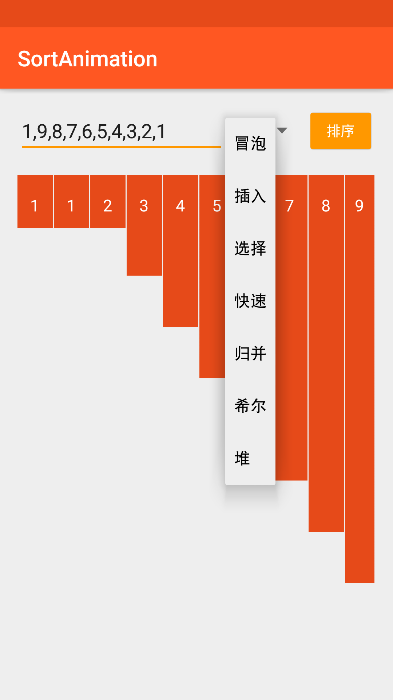
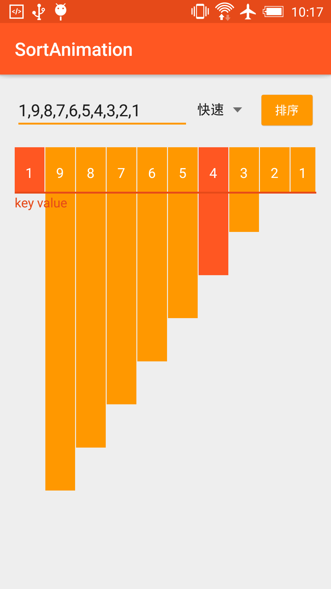
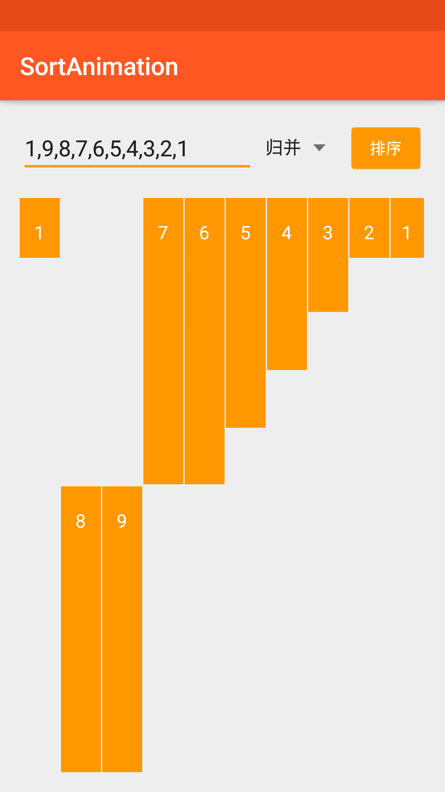

# SortAnimation
## 前言
最近在学习几种基础的排序算法，仅仅凭借算法的定义，公式，是在是不好理解，就在网上寻找有没有动画演示的以内方便我理解，果然已经有人实现了排序演示，有java实现的，有JS实现，想着能不能单击在android手机上看演示，
于是就找到了[ukhanoff/AndroidSortAnimation](https://github.com/ukhanoff/AndroidSortAnimation)
，一个国际友人，用android实现了基础的冒泡排序法。

在这之前，我不知道如何下手，在他的启发下，我增加了其他几种排序算法动画，同时将上边的自定义图形，从球形设置成了长方体，整体观感上和JS上，效果差不多了。

先讲下[ukhanoff/AndroidSortAnimation](https://github.com/ukhanoff/AndroidSortAnimation)
实现的冒泡排序法，用到了哪几个基础知识：


## 前言
### Android属性动画之ValueAnimator
### 自定义View
### Android ViewGroup中addView方法使用

首先我们先实现小球

有了小球之后，我们再来让跳动起来

现在的小球可以跳动了，但还是通过button来实现，接下来将控制小球变色的角色交给ValueAnimator
ValueAnimator仅仅作为一个数字发生器，结合奇偶性让小球变色。


全部代码请移步[ukhanoff/AndroidSortAnimation](https://github.com/ukhanoff/AndroidSortAnimation)

接下来，我来举例讲讲我fork他的项目后，参考JS实现效果，将小球变为长方体，陆续实现七种常见的算法，我这里单独举一个实现归并算法的大概步骤，相对来说，有元素从原数组取出，重新组成新的一组，相对有些难度：

所以MergeStepsInterface主要由以下几个需要实现的功能呢，从原数组中选择元素组成新数组，顺序为从小到大，再将新生成的从小到大的数组重新合并到原数组中，所以接口如下：

```java

package pri.weiqiang.sortanimation.animation;

/**
 * Created by weiqiang
 */

public interface MergeStepsInterface {

    /**
     * 从原数组中选择元素组成新数组，顺序为从小到大
     *
     * @param originalPosition 在原数组中的位置
     * @param tempPosition     在新生成的数组中的位置
     * @param isMerge          是否是处于将新生成的数组放置回原数组的那个步骤
     */
    void createTempView(int originalPosition, int tempPosition, boolean isMerge);

    /**
     * 将新生成的从小到大的数组重新合并到原数组中去
     *
     * @param originalPosition 在原数组中的位置
     * @param tempPosition     在新生成的数组中的位置
     * @param isMerge          是否是处于将新生成的数组放置回原数组的那个步骤
     */
    void mergeOriginalView(int originalPosition, int tempPosition, boolean isMerge);

    /**
     * Call when last item was sorted. Notifies user that sorting is finished.
     */
    void showFinish();

    /**
     * Cancel all current animations
     */
    void cancelAllVisualisations();
}

```


## 前言
SortAnimation实现了android平台下的动画效果，包含冒泡、插入、选择、快速、归并、希尔、堆排序。最初由[ukhanoff/AndroidSortAnimation](https://github.com/ukhanoff/AndroidSortAnimation)更改完成，其使用小球实现了冒泡排序，我则参考
[在线动画演示各种排序算法过程 - aTool在线工具](http://www.atool.org/sort.php)、[liusaint/sortAnimation](https://github.com/liusaint/sortAnimation)的动画效果实现了Android端的排序动画。

## 效果图

  

## Forked

- [ukhanoff/AndroidSortAnimation](https://github.com/ukhanoff/AndroidSortAnimation)
- [liusaint/sortAnimation](https://github.com/liusaint/sortAnimation)
- [在线动画演示各种排序算法过程 - aTool在线工具](http://www.atool.org/sort.php)


### 感谢浏览，喜欢请赏star。